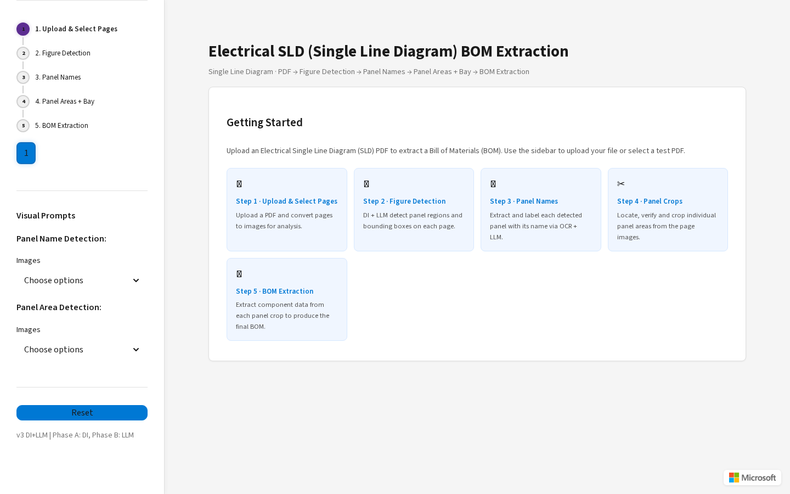
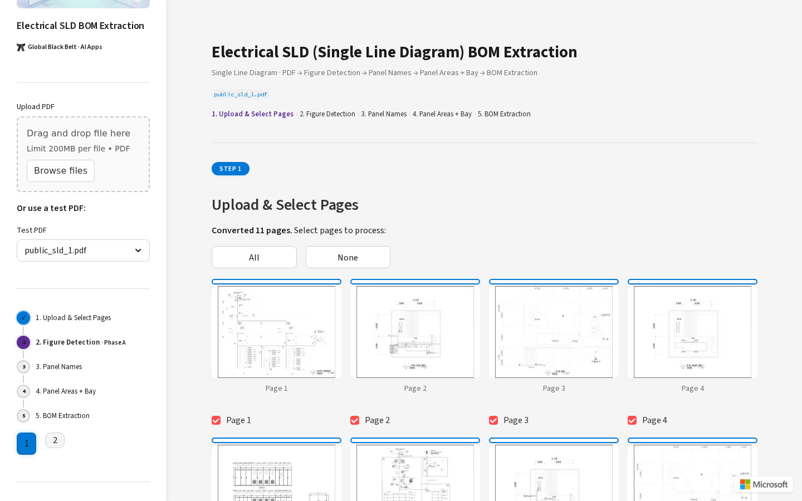
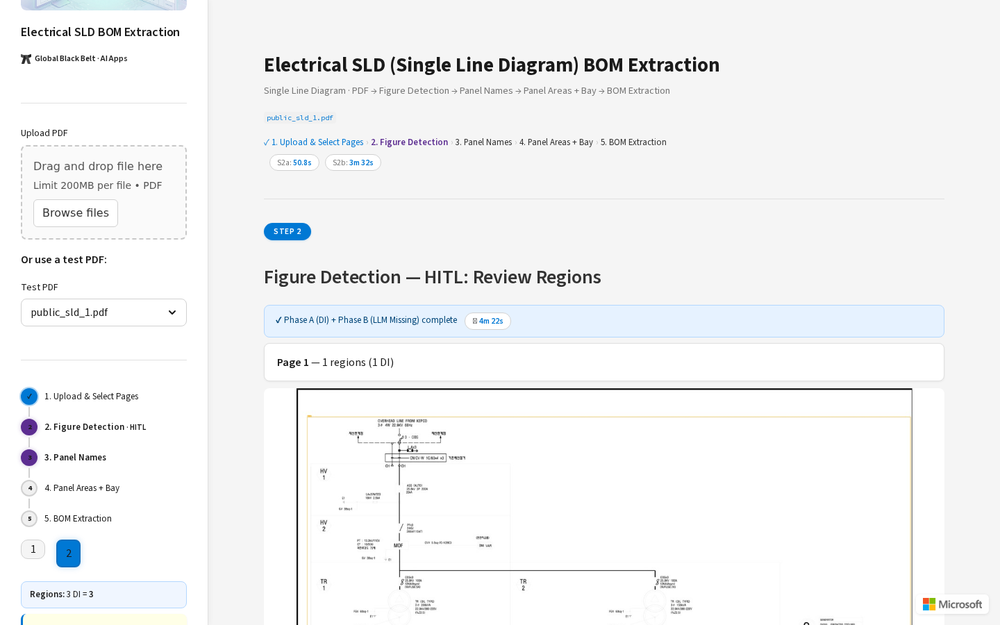
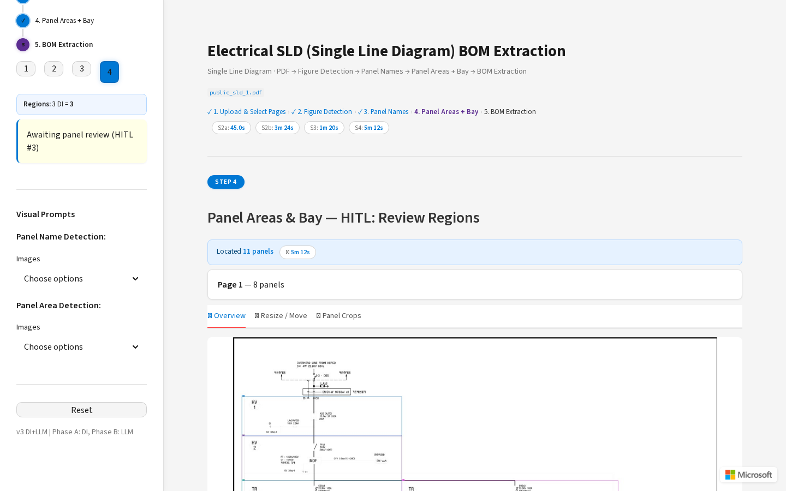
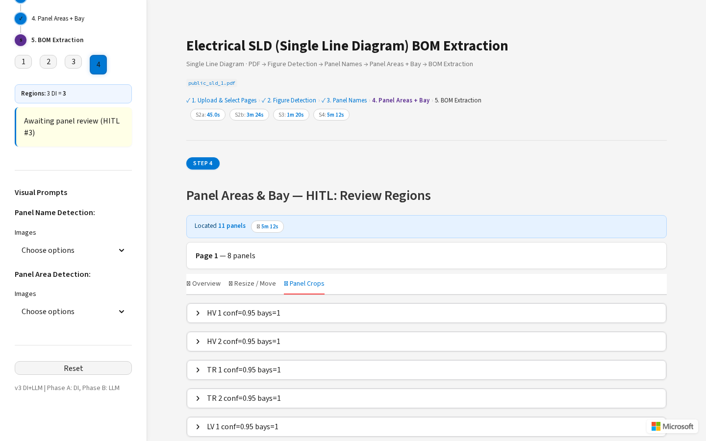
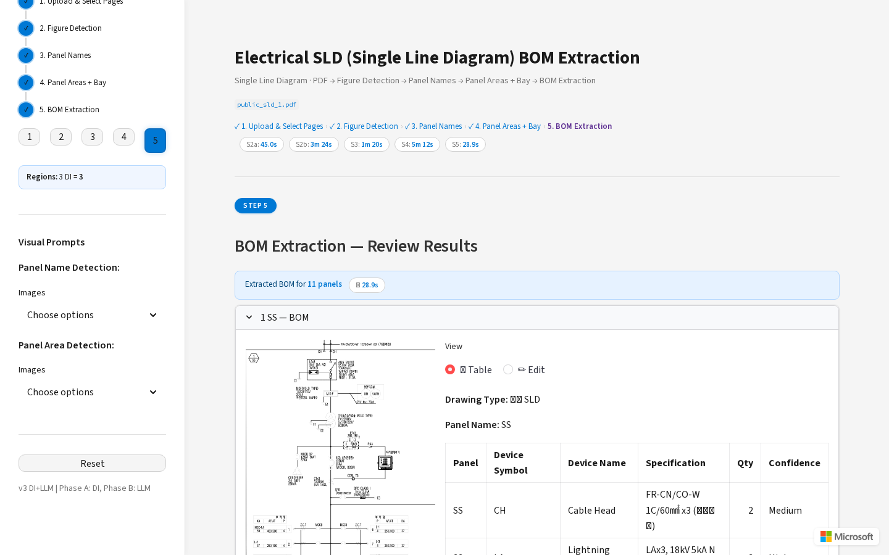

# Electrical SLD (Single Line Diagram) BOM Extraction

Agentic pipeline for extracting electrical panel areas and Bill of Materials (BOM) from CAD Single Line Diagrams.

Uses **Azure OpenAI** (GPT-5.4) + **Azure Document Intelligence** for detection and extraction, with a **Streamlit** Human-in-the-Loop UI.

## Demo Screenshots

| Getting Started | Step 1 — Upload & Select Pages |
|:---:|:---:|
|  |  |

| Step 2 — Figure Detection (HITL #1) | Step 4 — Panel Areas & Bay |
|:---:|:---:|
|  |  |

| Step 4 — Panel Crops | Step 5 — BOM Extraction |
|:---:|:---:|
|  |  |

## Prerequisites

- **Python 3.10+**
- **Azure OpenAI** resource (GPT-5.4 or later with Responses API support)
- **Azure Document Intelligence** resource (prebuilt-layout model)

## Quick Start

### Option A — One-command setup

```bash
git clone https://github.com/<your-org>/electrical-sld-bom-extraction.git
cd electrical-sld-bom-extraction
bash setup.sh          # Creates venv, installs deps, copies .env.example
```

### Option B — Manual setup

```bash
git clone https://github.com/<your-org>/electrical-sld-bom-extraction.git
cd electrical-sld-bom-extraction

# 1. Create virtual environment
python3 -m venv venv
source venv/bin/activate

# 2. Install dependencies
pip install --upgrade pip
pip install -e ".[dev]"

# 3. Configure environment
cp .env.example .env
# Edit .env with your Azure credentials (see below)

# 4. Create output directories
mkdir -p outputs checkpoints
```

### Configure Azure Credentials

Edit `.env` with your actual values:

```bash
# Azure OpenAI
AZURE_OPENAI_ENDPOINT=https://<your-resource>.openai.azure.com/
AZURE_OPENAI_API_KEY=<your-key>          # or leave empty for DefaultAzureCredential
AZURE_OPENAI_API_VERSION=2025-03-01-preview
AZURE_OPENAI_DEPLOYMENT=<your-deployment>  # e.g. gpt-5.4

# Azure Document Intelligence
AZURE_DI_ENDPOINT=https://<your-di>.cognitiveservices.azure.com
AZURE_DI_KEY=<your-key>                  # or leave empty for DefaultAzureCredential
```

### Run the Demo

```bash
source venv/bin/activate

# Streamlit UI (recommended)
make run
# or directly:
streamlit run src/hitl/streamlit_app.py --server.port 8501

# FastAPI server (optional)
make run-api
```

Open **http://localhost:8501** in your browser. Select `public_sld_1.pdf` from the sidebar dropdown to try the sample data.

## Architecture

```
Segment → Detect → MissingDetect → NameExt → Match → LocateVerify → Validation → BaySplit
                         ↕              ↕                    ↕
                    HITL #1         HITL #2              HITL #3
              (confirm regions)  (confirm names)   (confirm areas/bays)
```

### Pipeline Stages

| # | Executor | Role | HITL |
|---|----------|------|------|
| 1 | **SegmentExecutor** | PDF → per-page PNG + SVG (PyMuPDF with auto-DPI) | — |
| 2 | **DetectExecutor** | Azure Document Intelligence 2-pass figure detection | — |
| 3 | **MissingDetectExecutor** | LLM-based detection of figure regions DI missed + verification | **HITL #1**: confirm/edit figure region bboxes |
| 4 | **NameExtExecutor** | Tile-based panel name extraction via LLM + hallucination guard | — |
| 5 | **MatchExecutor** | 6-pass rule engine + LLM fallback to match names → DI text bboxes | **HITL #2**: confirm/edit panel names + label bboxes |
| 6 | **LocateVerifyExecutor** | Iterative locate→verify loop for panel area boundaries | — |
| 7 | **ValidationExecutor** | Cross-panel validation + confidence-based HITL routing | — |
| 8 | **BaySplitExecutor** | Bay subdivision within verified panels | **HITL #3**: confirm/edit panel area + bay bboxes |

### Streamlit UI (5 Steps + 3 HITL Checkpoints)

| UI Step | Action | Wait Time |
|---------|--------|-----------|
| Step 1 | Upload PDF → Select Pages → Convert to PNG | ~5s |
| Step 2 | Figure Detection (DI + LLM) | 30-120s |
| HITL #1 | Review/edit figure region bounding boxes | — |
| Step 3 | Panel Name Extraction (OCR + LLM) | 30-120s |
| HITL #2 | Review/edit panel names + label boxes | — |
| Step 4 | Panel Area + Bay Detection (LLM) | 60-180s |
| HITL #3 | Review/edit panel areas + bay divisions | — |
| Step 5 | BOM Extraction | 30-120s |

### HITL Flow (3 Checkpoints)

1. **HITL #1 — Figure Regions**: DI + LLM detected regions with bboxes overlaid. Drag to move, add/remove regions.
2. **HITL #2 — Panel Names**: Extracted names with blue overlay boxes. Add/rename/delete names, toggle overlay.
3. **HITL #3 — Panel Areas & Bays**: Panel area bboxes + bay dividers. Adjust boundaries, add/modify cropped regions.

Visual prompt images can be selected in the sidebar to improve LLM accuracy:
- **Panel Name Detection**: `panel_name_box_example1.png`, `panel_name_box_example2.png`
- **Panel Area Detection**: `panel_box_explanation.png`

## Project Structure

```
electrical-sld-bom-extraction/
├── pyproject.toml          # Dependencies & build config
├── requirements.lock.txt   # Pinned versions for reproducibility
├── setup.sh                # One-command environment setup
├── Makefile                # Common commands
├── .env.example            # Template for Azure credentials
├── data/                   # Sample SLD PDFs + visual prompt images
│   ├── public_sld_1.pdf
│   ├── public_sld_2.pdf
│   ├── panel_box_explanation.png
│   ├── panel_name_box_example1.png
│   ├── panel_name_box_example2.png
│   └── bay_example.png
├── src/
│   ├── config.py
│   ├── models/             # Pydantic data models
│   ├── tools/              # Pure functions (PDF, image, geometry)
│   ├── agents/             # LLM-based logic (prompts, matching, extraction)
│   ├── validators/         # Cross-panel validation
│   ├── workflow/           # Pipeline executor classes
│   ├── hitl/               # Streamlit UI + review queue
│   └── api/                # FastAPI routes
└── tests/
    ├── e2e_demo_test.py    # Playwright E2E test
    └── e2e_full_test.py    # Full scenario E2E test
```

## Make Commands

| Command | Description |
|---------|-------------|
| `make setup` | Full environment setup (venv + deps + .env) |
| `make run` | Start Streamlit UI (port 8501) |
| `make run-bg` | Start in tmux (disconnect-safe) |
| `make run-api` | Start FastAPI server (port 8000) |
| `make test` | Run pytest |
| `make test-e2e` | Run Playwright E2E test |
| `make venv-fix` | Recreate venv (fixes broken shebang) |
| `make freeze` | Update requirements.lock.txt |
| `make status` | Check server/tmux/venv status |
| `make clean` | Remove outputs and caches |

## Testing

```bash
# Unit tests
make test

# E2E test (requires running Streamlit server + Playwright)
pip install playwright && playwright install chromium
make test-e2e
```

## API Endpoints

| Method | Path | Description |
|--------|------|-------------|
| `POST` | `/api/run` | Start extraction (`{"pdf_path": "..."}`) |
| `GET` | `/api/run/{id}` | Check run status |
| `GET` | `/api/reviews` | List pending HITL reviews |
| `POST` | `/api/reviews/{id}` | Submit HITL corrections |
| `GET` | `/api/results/{id}` | Get final results |
| `GET` | `/health` | Health check |

## Azure Infrastructure (Persistent State)

파이프라인 상태를 영구 저장하고, 동일 파일 캐싱 및 실시간 진행 상태 추적을 위한 Azure 인프라.

### Resources

| Resource | Purpose | SKU |
|----------|---------|-----|
| **App Service** | Streamlit HITL UI 호스팅 | B2 (Linux, Python 3.12) |
| **Cosmos DB** (Serverless) | 파이프라인 실행 상태, 단계별 상태, 파일 캐시 메타데이터 | Serverless |
| **Blob Storage** | 중간 결과물 (이미지, JSON) 영구 저장 | Standard LRS |
| **Service Bus** | 비동기 작업 큐, 실시간 진행 상태 이벤트 | Standard |

### Deploy Infrastructure

```bash
# 1. Login to Azure
az login

# 2. Deploy dev environment (Korea Central)
./infra/deploy.sh dev koreacentral

# 3. Deploy prod environment
./infra/deploy.sh prod koreacentral
```

`deploy.sh`는 다음을 자동으로 수행합니다:
1. 리소스 그룹 생성 (`rg-sldbom-{env}`)
2. Bicep 템플릿으로 인프라 배포 (Cosmos DB, Storage, Service Bus, App Service)
3. App Service Managed Identity에 RBAC 역할 할당
4. 애플리케이션 코드를 App Service에 zip 배포 (`--clean` 모드)
5. `.env.cloud` 파일 자동 생성

배포 완료 후 App Service URL (`https://app-sldbom-{env}.azurewebsites.net`)에서 데모에 접속할 수 있습니다.

### App Service Deployment Details

| Item | Value |
|------|-------|
| **Runtime** | Python 3.12 (Linux) |
| **Startup** | `startup.sh` — 영구 venv 생성, pip install, Streamlit 실행 |
| **Build** | Oryx 비활성화 (`SCM_DO_BUILD_DURING_DEPLOYMENT=false`), startup.sh가 직접 관리 |
| **Port** | 8000 (Streamlit) |
| **Auth** | Managed Identity (DefaultAzureCredential) |
| **Venv Cache** | `/home/site/venv` — 컨테이너 재시작 시에도 유지됨 |

> **참고**: 첫 배포 시 pip install로 인해 컨테이너 시작에 ~5-10분 소요됩니다. 이후 재시작은 캐시된 venv를 사용하여 ~30초 이내입니다.

### Manual Code Redeploy (without infra changes)

인프라 변경 없이 코드만 재배포할 때:

```bash
cd electrical-sld-bom-extraction

# 1. Create deployment zip
zip -r /tmp/deploy.zip src/ data/ startup.sh requirements.txt pyproject.toml \
  -x "*.pyc" "*__pycache__*" "data/h_test.pdf" "data/test.pdf"

# 2. Deploy (--clean removes old files)
az webapp deploy \
  --resource-group rg-sldbom-dev \
  --name app-sldbom-dev \
  --src-path /tmp/deploy.zip \
  --type zip --clean true
```

### Infrastructure Files

```
infra/
├── main.bicep              # 메인 템플릿 (4개 모듈 오케스트레이션)
├── modules/
│   ├── appservice.bicep     # App Service + App Service Plan
│   ├── cosmosdb.bicep       # Cosmos DB Serverless + 3 containers
│   ├── storage.bicep        # Blob Storage + lifecycle policy
│   └── servicebus.bicep     # Service Bus + queue + topic
├── parameters/
│   ├── dev.bicepparam       # 개발 환경 파라미터
│   └── prod.bicepparam      # 운영 환경 파라미터
├── deploy.sh                # 배포 스크립트 (Bicep + RBAC + zip deploy)
└── teardown.sh              # 인프라 삭제 스크립트
```

### Teardown

```bash
./infra/teardown.sh dev      # dev 환경 삭제
./infra/teardown.sh prod     # prod 환경 삭제
```

### Required Python Packages (for state management)

```bash
pip install azure-cosmos azure-storage-blob azure-servicebus
```

> 전체 계획은 [docs/persistent-state-plan.md](docs/persistent-state-plan.md) 참조.

## Key Design Decisions

- **Multi-stage pipeline** — each stage has a dedicated executor class
- **Confidence-based HITL** — only panels below threshold (0.7) trigger human review
- **Hallucination guard** — LLM-extracted panel names validated against DI OCR output
- **Oscillation detection** — prevents locate→verify from endlessly toggling edge coordinates
